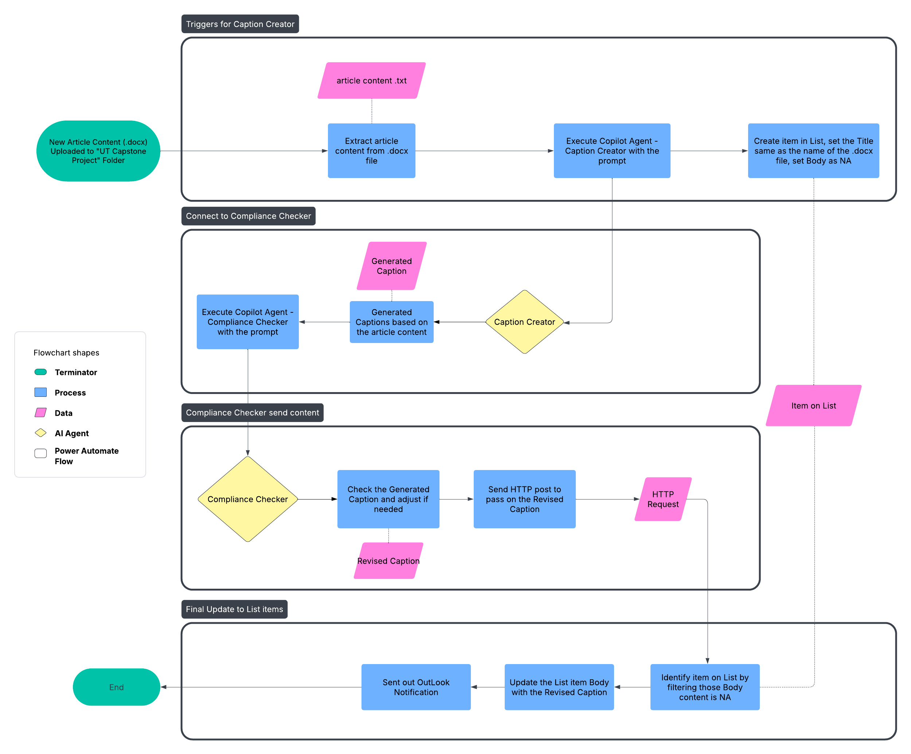

# TDECU AI-Powered Caption Generation System

## 📋 Introduction

Our capstone team partnered with Texas Dow Employees Credit Union (TDECU), now rebranding as Space City Financial, to help rebuild their LinkedIn presence following a major merger.
We developed an AI-powered caption generation system that streamlines social media content creation for employees while maintaining brand consistency and compliance.

## 📁 Project Folder Structure

```graphql

TDECU-Caption-Generation-System/
├── README.md
├── docs/
│   ├── project_summary.md        # Full project description 
│   ├── system_architecture.png   # Diagram showing how the system flows 
│   ├── stakeholder_list.md       # List of stakeholders and their roles
│   ├── future_enhancements.md    # Ideas for future upgrades (multi-platform, analytics, A/B testing)
├── flows/
│   ├── caption_generation_flow.png    # Screenshot/diagram of Power Automate flow
│   └── flow_descriptions.md           # Brief descriptions of what each flow does
├── ai_model/
│   ├── copilot_prompts.md             # Simple example prompts/templates used
│   ├── detailed_prompt_instructions.md # Full detailed instruction prompt fed into Copilot
│   └── copilot_usage_notes.md         # Integration and usage notes for Copilot Studio AI Agent
├── screenshots/
│   ├── homepage.png                # How the system looks to employees
│   ├── notification_example.png    # Example notification employees receive
│   └── sharepoint_access_view.png  # What the SharePoint page looks like

```
## 📊 System Flow Overview



